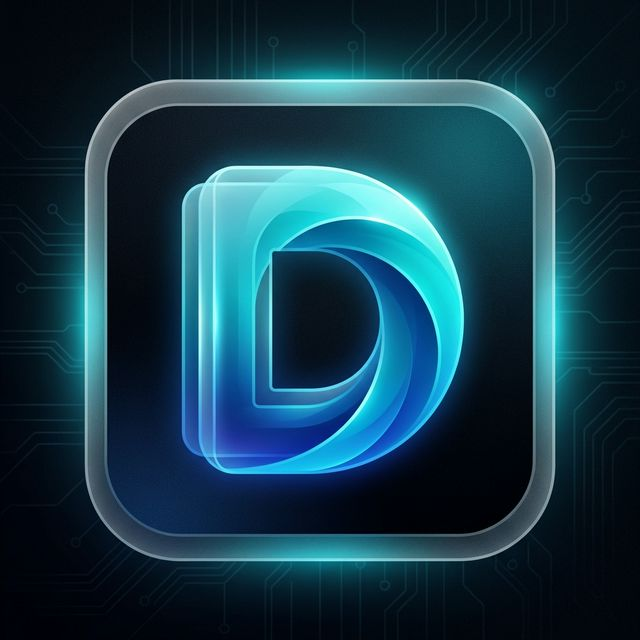

<p align="center">
  
</p>

<h1 align="center">🤖 DeVA - Your AI Phone Operator</h1>

<p align="center">
  <strong>✨ You touch grass. I'll touch your glass. ✨</strong>
</p>

<p align="center">
  <em>An open-source AI agent that sees, speaks, and controls your Android phone through voice commands</em>
</p>

<p align="center">
  <a href="#-features"></a>
  <a href="#-example-commands"></a>
  <a href="#-quick-start"></a>
  <a href="#-architecture"></a>
</p>

<p align="center">
  
  
  
  
</p>

---

## 🌟 What is DeVA?

**DeVA (Device Virtual Assistant)** is a revolutionary AI-powered Android assistant that doesn't just respond to your voice—it **actually operates your phone for you**. Think of it as having a personal assistant sitting next to you, tapping, swiping, and navigating through apps on your behalf.

```
🗣️ "Hey DeVA, send a good morning text to Mom"
📱 *DeVA opens Messages, finds Mom, types & sends the message*
✅ "Done! Message sent to Mom"
```

### Why DeVA is Different

| Traditional Assistants | DeVA |
|----------------------|------|
| ❌ Limited to specific app integrations | ✅ Works with ANY app on your phone |
| ❌ Can only answer questions | ✅ Actually performs actions |
| ❌ Requires API support from each app | ✅ Uses visual UI automation |
| ❌ Closed source, privacy concerns | ✅ 100% Open Source |

## 🎯 Example Commands

| Task | Voice Command |
|------|---------------|
| 📧 Send Messages | "Send a text to John saying I'll be late" |
| 🎵 Play Music | "Open Spotify and play my liked songs" |
| ⏰ Set Alarms | "Set an alarm for 7:30 AM tomorrow" |
| 📸 Take Photos | "Open camera and take a selfie" |
| 🌤️ Check Weather | "What's the weather like today?" |
| 📱 Open Apps | "Open Instagram and go to my messages" |
| 🔍 Search | "Search for nearby restaurants on Google Maps" |
| 💬 LinkedIn | "Send welcome message to all new connections" |

---

## ✨ Features

<table>
<tr>
<td width="50%">

### 🧠 Intelligent UI Automation
DeVA sees your screen through accessibility services, understands the context of UI elements, and performs actions like a human would—tapping, swiping, and typing.

### 🎙️ Natural Voice Interaction
High-quality voice recognition and speech synthesis powered by Google's advanced AI. Just speak naturally, and DeVA understands.

### 👁️ Vision Capability
DeVA can analyze what's on your screen and provide context-aware responses. Ask "What's on my screen?" and get intelligent summaries.

</td>
<td width="50%">

### 🔊 Wake Word Detection
Say "Hey DeVA" to wake up your assistant anytime, anywhere. No need to open the app first.

### 🔐 Privacy First
100% open source. Your voice data stays on your device. No shady data collection.

### 📲 Works with ANY App
Unlike traditional assistants limited to specific integrations, DeVA can interact with any app on your phone through UI automation.

</td>
</tr>
</table>

---

## 🏗️ Architecture

DeVA is built on a sophisticated multi-agent system that separates responsibilities for reliable reasoning:

```
┌─────────────────────────────────────────────────────────────┐
│                     🧠 THE BRAIN (LLM)                      │
│            Gemini-powered reasoning & planning              │
├─────────────────────────────────────────────────────────────┤
│                                                             │
│  ┌──────────────┐    ┌──────────────┐    ┌──────────────┐  │
│  │   👂 EARS    │    │   👁️ EYES    │    │   🖐️ HANDS   │  │
│  │  STT/TTS    │◄──►│ Accessibility │◄──►│   Actions    │  │
│  │   Voice     │    │   Service     │    │  Tap/Swipe   │  │
│  └──────────────┘    └──────────────┘    └──────────────┘  │
│                                                             │
├─────────────────────────────────────────────────────────────┤
│                    📱 YOUR ANDROID DEVICE                   │
└─────────────────────────────────────────────────────────────┘
```

### Core Components

- **ConversationalAgentService** - Handles voice interactions and conversation flow
- **AgentService** - Executes multi-step tasks through UI automation
- **Eyes (Accessibility)** - Reads screen content and UI hierarchy
- **SpeechCoordinator** - Manages STT/TTS for natural voice interaction
- **GeminiApi** - Powers intelligent decision making

---

## ⚡ Quick Start

### Prerequisites

- 📱 Android device with API Level 26+ (Android 8.0+)
- 🛠️ Android Studio (latest version recommended)
- 🔑 Gemini API keys

### Installation

1. **Clone the repository**
   ```bash
   git clone https://github.com/devanshupardeshi/DeVA.git
   cd DeVA
   ```

2. **Configure API Keys**
   
   Create `local.properties` in the project root:
   ```properties
   # Option 1: Direct Gemini API keys (recommended for testing)
   GEMINI_API_KEYS=your_api_key_1,your_api_key_2
   
   # Option 2: Custom proxy server
   GCLOUD_PROXY_URL=your_backend_url
   GCLOUD_PROXY_URL_KEY=your_password
   ```

3. **Build & Run**
   - Open in Android Studio
   - Let Gradle sync dependencies
   - Run on your device

4. **Enable Permissions**
   - Grant Accessibility Service permission
   - Grant Microphone permission
   - Enable Overlay permission (for floating UI)

---

## 🎯 Example Commands

<table>
<tr>
<td>

**Communication**
- "Text Mom that I'm on my way"
- "Send an email to my boss"
- "Call the pizza place"
- "Reply to the last WhatsApp message"

</td>
<td>

**Entertainment**
- "Play my workout playlist on Spotify"
- "Open YouTube and play lofi music"
- "Find a funny video on TikTok"
- "Open Netflix"

</td>
</tr>
<tr>
<td>

**Productivity**
- "Set a timer for 15 minutes"
- "Create a reminder for tomorrow at 9 AM"
- "Take a note: buy groceries"
- "Search for flights to New York"

</td>
<td>

**Navigation**
- "Navigate to the nearest gas station"
- "How do I get home?"
- "Find coffee shops near me"
- "Open Google Maps directions to work"

</td>
</tr>
</table>

---

## 🛠️ Tech Stack

| Technology | Purpose |
|------------|---------|
| **Kotlin** | Primary development language |
| **Gemini AI** | Natural language understanding & decision making |
| **Android Accessibility API** | Screen reading & UI automation |
| **Firebase** | Analytics & user management |
| **Google Cloud TTS** | High-quality voice synthesis |
| **Porcupine** | Wake word detection |

---

## 🤝 Contributing

We love contributions! Whether it's:

- 🐛 Bug reports
- 💡 Feature suggestions  
- 📖 Documentation improvements
- 🔧 Code contributions

Check out our [Contributing Guide](CONTRIBUTING.md) to get started.

### Quick Contribution Guide

```bash
# Fork the repo
# Clone your fork
git clone https://github.com/devanshupardeshi/DeVA.git

# Create a feature branch
git checkout -b feature/amazing-feature

# Make your changes & commit
git commit -m "Add amazing feature"

# Push & create a PR
git push origin feature/amazing-feature
```

---

## 📜 License

This project is licensed under a **Personal Use License**.

| Use Case | Allowed |
|----------|---------|
| ✅ Personal & Educational | Yes |
| ✅ Research & Learning | Yes |
| ⚠️ Commercial Use | Requires separate license |

See [LICENSE](LICENSE) for details.

---

## 🌟 Star History

If you find DeVA useful, please consider giving it a ⭐!

[](https://star-history.com/#devanshupardeshi/DeVA&Timeline)

---

## 🙏 Acknowledgments

- Built with ❤️ for the open-source community
- Powered by Google's Gemini AI
- Inspired by the need for truly accessible technology

---

<p align="center">
  <b>Made with 💙 by developers who believe AI should work FOR you</b>
</p>
